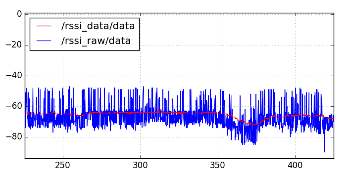

# BLE_TEST ROS

## Hướng dẫn sử dụng:

* Subcribe topic /rssi_raw để lấy thông tin rssi chưa qua sử dụng bộ lọc.
* Subcribe topic /rssi_data để lấy thông tin rssi đã qua bộ lọc [Kalman](https://github.com/denyssene/SimpleKalmanFilter).

Hình ảnh thu được: `sử dụng rqt_plot để view`

